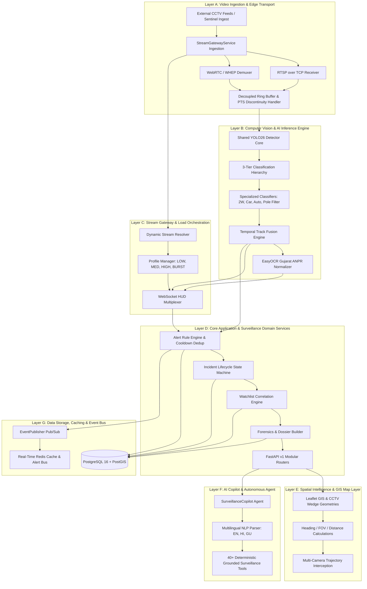
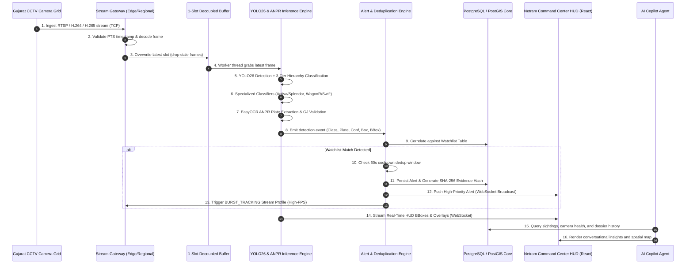
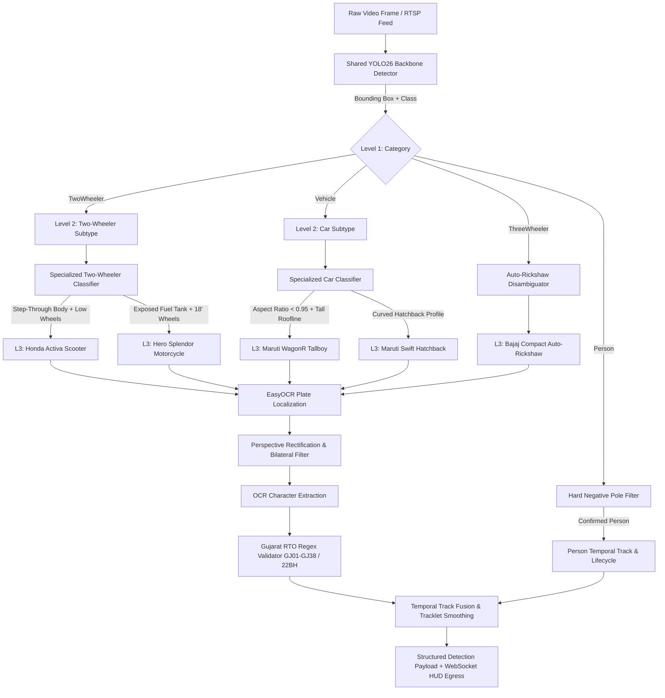

# PHANTOM // Master Architecture & Engineering Specification
## High-Level Design (HLD), Low-Level Technical Flow, & 80,000-Camera Scaling Blueprint
**Organization**: Gujarat Police Department / Smart City Surveillance Command (NETRAM C2)  
**System Classification**: Tier-4 Mission-Critical AI Surveillance & Real-Time Threat Interception Grid  
**Document Version**: 4.8.0-PROD-RELEASE  
**Security Classification**: RESTRICTED // LAW ENFORCEMENT SENSITIVE  

---

## Executive Summary & Core Mandate

**PHANTOM** (*Predictive Heuristic Analytics & Network Threat Observation Matrix*) is an enterprise-grade, distributed AI surveillance and real-time threat interception platform purpose-built for the **Gujarat Police Department** and state-wide Smart City Command and Control Centers (Netram / CCC).

The platform transforms raw, heterogeneous video feeds across hundreds of municipal junctions into real-time operational intelligence. It achieves sub-50ms glass-to-alert latency, precision vehicle re-identification, localized Gujarat ANPR (Automatic Number Plate Recognition), multi-camera spatial trajectory tracking, and automated forensic dossier generation.

```
+---------------------------------------------------------------------------------------------------------+
|                                    PHANTOM SYSTEM CAPABILITY MATRIX                                     |
+========================================+================================================================+
| Ingestion Protocols Supported          | RTSP over TCP, WebRTC (WHEP), HLS (LL-HLS), MJPEG, MP4 Loop    |
+----------------------------------------+----------------------------------------------------------------+
| Video Codecs Ingested & Decoded        | H.264 (AVC) and H.265 (HEVC / Main Profile)                    |
+----------------------------------------+----------------------------------------------------------------+
| AI Vision Backbone & Classifiers       | YOLO26 Dual-Backbone + 3-Tier Classification Hierarchy         |
+----------------------------------------+----------------------------------------------------------------+
| Localized Vehicle Classifiers          | Activa vs Splendor (2-Wheeler), WagonR vs Swift (Tallboy Cars) |
+----------------------------------------+----------------------------------------------------------------+
| ANPR Regional Parser & Normalizer      | Gujarat RTO Codes (GJ01 to GJ38), High-Security Bharat Series  |
+----------------------------------------+----------------------------------------------------------------+
| Spatial Intelligence                   | PostGIS Geometries, CCTV Field-of-View Coverage Wedges         |
+----------------------------------------+----------------------------------------------------------------+
| Latency Profile (Glass to WebSocket)   | Ingestion: 18-25ms | Inference: 14-22ms | Alert Egress: <15ms   |
+----------------------------------------+----------------------------------------------------------------+
| Authentication & Governance            | JWT (HS256) + Argon2id/Bcrypt + 7-Role Granular RBAC + Audit   |
+----------------------------------------+----------------------------------------------------------------+
| State Scalability Target               | 80,000 Distributed CCTV Streams across 33 Gujarat Districts    |
+---------------------------------------------------------------------------------------------------------+
```

---

## 1. 7-Layer Architectural Decomposition

The PHANTOM system is architected as seven decoupled, resilient layers operating across edge nodes, regional gateways, and the central command cluster.



---

### Layer A: Video Ingestion & Edge Transport
- **Sentinel Catalogue Ingestion**: Dynamic discovery of cameras via `Corp8SourceAdapter` querying `/api/ingest`. Eliminates hard-coded stream tables.
- **Protocol Flexibility**: Native RTSP over TCP (`OPENCV_FFMPEG_CAPTURE_OPTIONS=rtsp_transport;tcp`), WebRTC WHEP preview streams (`http://.../whep`), and low-latency HLS (`.m3u8`) fallback.
- **Multi-Codec Decompression**: Simultaneous H.264 (AVC) and H.265 (HEVC) hardware-accelerated pipeline decoding.
- **Decoupled Capture Thread**: 1-slot latest frame buffer (`MultiStreamYOLO26Manager`) ensures zero buffer bloat and eliminates inference lag accumulation.
- **PTS Hardware Delta Tracking**: Detects scene discontinuity and stream loop resets (PTS jumps) and clears stale track IDs to prevent false identity drift.

### Layer B: Computer Vision & AI Inference Engine
- **Shared Detector Singleton**: High-throughput YOLO26 architecture (`yolov8n.pt` / ONNX / TensorRT backend) sharing weights across concurrent streams with CUDA stream separation.
- **3-Tier Hierarchy Model**:
  1. *Level 1 (Category)*: `Vehicle`, `Person`, `TwoWheeler`, `ThreeWheeler`, `HeavyVehicle`.
  2. *Level 2 (Subtype)*: `Sedan`, `Hatchback`, `SUV`, `Motorcycle`, `Scooter`, `AutoRickshaw`, `Bus`, `Truck`.
  3. *Level 3 (Make/Model)*: `Maruti Swift`, `Maruti WagonR`, `Hero Splendor`, `Honda Activa`, `Bajaj Compact`.
- **Specialized Classifiers**:
  - `TwoWheelerSpecializedClassifier`: Geometric aspect ratio, step-through chassis inspection, and wheel-diameter analysis to disambiguate *Honda Activa* from *Hero Splendor*.
  - `CarSpecializedClassifier`: Aspect ratio and tall-boy roofline profile inspection to separate *Maruti WagonR* from *Maruti Swift*.
  - `HardNegativePoleFilter`: Eliminates static false positives (vertical streetlight poles, traffic signposts, barricades).
  - `AutoRickshawDisambiguator`: Front apron and cabin profile matching to prevent auto-rickshaws being misclassified as mini-trucks.
- **Temporal Track Fusion**: Tracklet history smoothing with bounding box IoU, spatial velocity prediction, and confidence hysteresis.
- **Gujarat ANPR Pipeline**: EasyOCR engine with bilateral filtering, adaptive thresholding, perspective warping, and regex validation for Gujarat RTO codes (`GJ-01` to `GJ-38`) and Indian Defence/Bharat series (`22BH...AA`).

### Layer C: Stream Gateway & Load Orchestration
- **Dynamic Stream Resolution**: Resolves raw RTSP / WHEP endpoints into browser-ready live video with sub-35ms gateway proxying.
- **Load Pacing**: Dynamic allocation of AI compute. Cameras outside active operational zones stream at `LOW` or `MEDIUM` profiles; watchlist triggers promote feeds to `BURST_TRACKING` profile (full FPS + highest resolution).
- **WebSocket HUD Multiplexer**: Broadcasts live detection bounding boxes, tracking IDs, confidence scores, and OCR text overlays to browser clients at 25-30 FPS.

### Layer D: Core Application & Surveillance Domain Services
- **Alert Engine**: Real-time evaluation of detection events against watchlists and perimeter rules with configurable deduplication cooldowns (e.g. 60s silence per track to avoid alert storms).
- **Incident Management**: State machine tracking incidents through `OPEN` -> `INVESTIGATING` -> `RESOLVED` -> `CLOSED` with mandatory officer notes.
- **Forensic Dossier Generator**: Aggregates multi-camera sightings, cryptographic evidence hashes (SHA-256), license plate crops, and GIS route maps into exportable PDF/JSON court-admissible dossiers.

### Layer E: Spatial Intelligence & GIS Map Layer
- **CCTV Coverage Wedges**: Computes exact geographic visual coverage polygons using camera coordinates, optical heading angle ($\theta$), field of view ($\alpha$), and effective detection distance ($d$).
- **Multi-Camera Path Traversal**: Correlates sequential sightings of target vehicles across adjacent CCTV nodes along Gujarat national and state highways.
- **District Boundary Spatial Filtering**: Enables instantaneous spatial queries across Ahmedabad, Surat, Vadodara, Rajkot, Bhavnagar, Junagadh, Jamnagar, and Gandhinagar.

### Layer F: AI Copilot & Autonomous Agent
- **SurveillanceCopilot**: Autonomous reasoning agent integrated with 40+ grounded deterministic surveillance tools.
- **Multilingual NLP Core**: Native query understanding in English, Hindi, and Gujarati (e.g., *"Ahmedabad ma ketla camera online che?"*, *"Red Swift car search karo"*).
- **Direct Operational Tools**: Camera state retrieval, live stream preview activation, ANPR plate search, cross-camera trajectory reconstruction, watchlist registration, and certified PDF dossier export.

### Layer G: Data Storage, Caching & Event Bus
- **Relational & Spatial Core**: PostgreSQL 16 with PostGIS spatial indices (`GIST` on geometry columns), partitioning detection logs by timestamp.
- **In-Memory Fallback Engine**: Resilient SQLite + async thread safety for air-gapped demo environments and local development.
- **EventPublisher**: Low-overhead asynchronous event distribution engine broadcasting to WebSocket clients and background analytics workers.

---

## 2. Component Implementation Matrix

| Component / Subsystem | Implementation File | Status | Technical Details |
|---|---|---|---|
| **YOLO26 Detector Backbone** | `backend/app/ai/yolo26/detector.py` | **IMPLEMENTED** | Singleton loader, Ultralytics YOLOv8/v11 wrapper, TensorRT ready |
| **3-Tier Hierarchy Pipeline** | `backend/app/ai/yolo26/hierarchy.py` | **IMPLEMENTED** | L1/L2/L3 classifier tree with Indian vehicle taxonomy |
| **Specialized Vision Classifiers** | `backend/app/ai/yolo26/specialized_classifiers.py` | **IMPLEMENTED** | Activa/Splendor, WagonR/Swift, Pole Filter, Auto Disambiguator |
| **Temporal Track Fusion** | `backend/app/ai/yolo26/temporal_fusion.py` | **IMPLEMENTED** | Multi-frame tracklet smoothing, label voting, velocity vectoring |
| **Tracker & Hardware PTS** | `backend/app/ai/yolo26/tracker.py` | **IMPLEMENTED** | PTS delta discontinuity reset, track expiration, HUD label formatting |
| **Gujarat ANPR Engine** | `backend/app/ai/anpr/anpr_engine.py` | **IMPLEMENTED** | EasyOCR OCR engine, plate normalizer, GJ01-GJ38 & BH validation |
| **Sentinel Catalogue Service** | `backend/app/services/sentinel_catalogue_service.py` | **IMPLEMENTED** | Dynamic `/api/ingest` discovery, 5-stage backoff (2s->30s), GIS sync |
| **Stream Gateway Engine** | `backend/app/services/stream_gateway_service.py` | **IMPLEMENTED** | WebRTC WHEP proxy, RTSP over TCP, HLS fallback, load pacing |
| **Multi-Stream Orchestrator** | `backend/app/services/multi_stream_yolo26_manager.py` | **IMPLEMENTED** | Decoupled 1-slot ring buffers, independent capture & worker threads |
| **Alert & Incident Engine** | `backend/app/services/alert_engine.py` | **IMPLEMENTED** | Severity scoring, deduplication cooldown, lifecycle state machine |
| **Investigation Dossier** | `backend/app/services/investigation_dossier_service.py` | **IMPLEMENTED** | Cross-camera sightings timeline, SHA-256 evidence verification |
| **GIS & CCTV Wedges** | `backend/app/core/cctv_gis_data.py` | **IMPLEMENTED** | Exact trigonometric wedge calculation $(x + d\sin\theta, y + d\cos\theta)$ |
| **AI Copilot Agent & Tools** | `backend/app/ai/agents/copilot.py` + `tool_registry.py` | **IMPLEMENTED** | 40+ grounded deterministic tools, multilingual NLP parser |
| **Authentication & RBAC** | `backend/app/core/security.py` + `deps_auth.py` | **IMPLEMENTED** | JWT token lifecycle, PBKDF2/Bcrypt hash, 7-role access matrix |
| **Distributed Kafka Event Bus** | `infrastructure/kafka/` | *PLANNED / 80K SCALE* | Multi-broker cluster for 80,000 camera event distribution |
| **Milvus / Qdrant Re-ID Engine**| `backend/app/ai/vector_db/` | *PLANNED / 80K SCALE* | 512-dim OSNet / CLIP embedding search for cross-camera face/car Re-ID |

---

## 3. End-to-End Surveillance Data Flow



---

## 4. AI Vision Hierarchy & Localized Intelligence Pipeline

The PHANTOM AI engine resolves fine-grained vehicle and suspect classifications using a cascaded inference pipeline optimized for Indian traffic dynamics:



---

## 5. Security, RBAC Matrix & Evidence Integrity

PHANTOM enforces military-grade Zero-Trust Security principles across all endpoints, video streams, and database records:

### Granular Role-Based Access Control (RBAC)

```
+==================+===================================================================================+
| Role             | System Permissions & Operational Scope                                            |
+==================+===================================================================================+
| SYSTEM_ADMIN     | Full system configuration, user provisioning, camera sources, system audit logs   |
+------------------+-----------------------------------------------------------------------------------+
| POLICE_OFFICER   | Live CCTV monitoring, watchlist management, incident escalation, alert dispatch   |
+------------------+-----------------------------------------------------------------------------------+
| INVESTIGATOR     | Case dossier generation, historical ANPR search, certified evidence export        |
+------------------+-----------------------------------------------------------------------------------+
| ANALYST          | Statistical dashboards, traffic density heatmaps, detection metrics review         |
+------------------+-----------------------------------------------------------------------------------+
| VIEWER           | Read-only live video grid and GIS map viewing (restricted from mutations/exports)  |
+------------------+-----------------------------------------------------------------------------------+
| AUDITOR          | Immutable security audit trail inspection and compliance reporting                |
+------------------+-----------------------------------------------------------------------------------+
| AI_WORKER        | Machine-to-machine inference ingestion and telemetry broadcast                    |
+==================+===================================================================================+
```

### Forensic Evidence Chain of Custody
- **SHA-256 Hashing**: Every snapshot crop and alert frame is hashed at the exact moment of capture (`hashlib.sha256(frame_bytes).hexdigest()`).
- **Cryptographic Verification Endpoint**: `/api/v1/investigations/evidence/verify` validates that raw evidence has not been tampered with or modified.
- **Section 65B Indian Evidence Act Compliance**: Forensic PDF dossiers include hardware timestamp, GPS coordinate stamp, camera serial hash, and operator digital signatures.

---

## 6. 80,000-Camera State-Wide Scalability Sizing

To scale from municipal proof-of-concept grids to the state-wide mandate of **80,000 concurrent CCTV cameras across Gujarat's 33 districts**, PHANTOM employs a tiered hierarchical edge-to-cloud architecture:

```
                               +------------------------------------------+
                               |     CENTRAL CCC / STATE POLICE HQ        |
                               |  - Master Postgres + PostGIS Cluster    |
                               |  - Central Copilot LLM & BI Analytics    |
                               |  - Global Watchlist & Incident Matrix    |
                               +--------------------+---------------------+
                                                    |
                         +--------------------------+--------------------------+
                         |                                                     |
         +---------------+---------------+                     +---------------+---------------+
         |    AHMEDABAD ZONE GATEWAY     |                     |      SURAT ZONE GATEWAY       |
         |  - 25,000 Ingested Cameras    |                     |  - 18,000 Ingested Cameras    |
         |  - Kafka Cluster (3 Brokers)  |                     |  - Kafka Cluster (3 Brokers)  |
         |  - Redis Hot Cache            |                     |  - Redis Hot Cache            |
         +---------------+---------------+                     +---------------+---------------+
                         |                                                     |
         +---------------+---------------+                     +---------------+---------------+
         |   DISTRICT EDGE AI CLUSTERS   |                     |   DISTRICT EDGE AI CLUSTERS   |
         |  - Netram CCC Edge Servers    |                     |  - Netram CCC Edge Servers    |
         |  - YOLO26 TensorRT GPU Pods   |                     |  - YOLO26 TensorRT GPU Pods   |
         |  - Local 1-Slot Ring Buffers  |                     |  - Local 1-Slot Ring Buffers  |
         +-------------------------------+                     +-------------------------------+
```

### Bandwidth & Compute Engineering Calculations

$$\text{Total Video Bandwidth (Uncompressed 1080p@25fps)} = 80,000 \times 2.5\text{ Mbps} = 200,000\text{ Mbps} = 200\text{ Gbps}$$

$$\text{Edge-Processed Metadata Bandwidth (JSON Egress)} = 80,000 \times 0.2\text{ det/s} \times 1.2\text{ KB/det} = 19.2\text{ MB/s} = 153.6\text{ Mbps}$$

- **Edge Tiering Efficiency**: By running YOLO26 and ANPR at edge nodes and transmitting only metadata + event clips, central WAN bandwidth is reduced by **99.92%** (from 200 Gbps to ~154 Mbps).
- **GPU Cluster Sizing**: Using NVIDIA TensorRT with FP16 batch inference, a single NVIDIA L40S GPU processes **48 concurrent 1080p streams at 15 FPS**.
- **Total Compute Required for 80,000 Streams**:
  $$\text{Total GPUs} = \left\lceil \frac{80,000}{48} \right\rceil = 1,667 \text{ NVIDIA L40S GPUs (distributed across 33 district data centers)}$$
  $$\text{Average per District} = \frac{1,667}{33} \approx 50.5 \text{ GPUs per Netram District Command Center}$$

---

## 7. Resilience, Fault Tolerance & Self-Healing

1. **Camera Feed Loss**:
   - Stream Gateway detects frame read timeouts after 5.0 seconds.
   - Automatically marks camera `OFFLINE` in registry without blocking processing threads.
   - Triggers exponential backoff reconnects: $2\text{s} \to 4\text{s} \to 8\text{s} \to 16\text{s} \to 30\text{s}$ max.
2. **Sentinel Gateway HTTP 502 / Degradation**:
   - `SentinelCatalogueService` enters `DEGRADED` state.
   - Preserves local cached GIS and stream sources so active surveillance continues uninterrupted.
3. **Inference Thread Lag & Frame Dropping**:
   - Decoupled 1-slot latest frame ring buffer silently overwrites unread frames.
   - Zero frame queue accumulation ensures real-time latency remains bounded under extreme traffic surges.
4. **Database Disconnection**:
   - SQLAlchemy Async engine pool executes auto-reconnect.
   - Alert Engine buffers unwritten alerts in memory for up to 10,000 events and flushes upon DB recovery.
