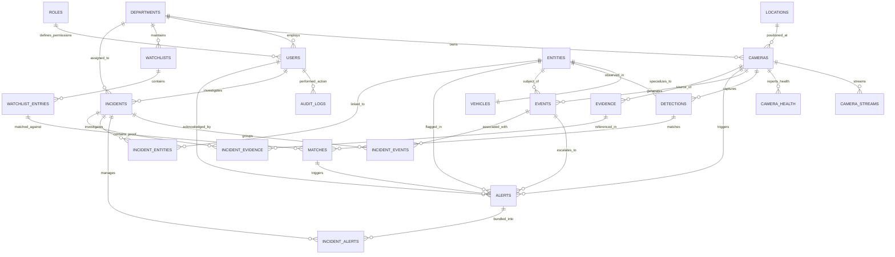

# PHANTOM Database Architecture & Schema Specification

This document provides the complete Entity-Relationship (ER) model and technical architecture for the **PHANTOM Statewide Video Intelligence & Investigation Platform**.

---

## 1. High-Level Entity-Relationship Model

---

## 2. Table Specifications & Cardinalities

### 1. `departments`
- **Purpose**: Stores the 26 state departments (e.g. Police, RTO, AMC, SMC, GIDC, Forest, GMB Ports).
- **Primary Key**: `id` (`UUID`)
- **Key Fields**: `code` (Unique), `name`, `is_active`, `contact_email`, `contact_phone`.

### 2. `roles` & `users`
- **Purpose**: Role-Based Access Control (RBAC).
- **Roles**: `SYSTEM_ADMIN`, `POLICE_OFFICER`, `DEPARTMENT_OFFICER`, `RTO_OFFICER`, `ANALYST`, `INVESTIGATOR`, `AUDITOR`, `VIEWER`.
- **Security**: Passwords hashed with bcrypt; user sessions auditable.

### 3. `locations`
- **Purpose**: Spatial repository for camera and event coordinates in Gujarat.
- **Key Columns**: `latitude`, `longitude`, and generated `geom` (`GEOGRAPHY(Point, 4326)`).
- **Index**: Spatial GiST Index for sub-millisecond geodesic distance calculations.

### 4. `cameras`
- **Purpose**: Statewide camera hardware registry.
- **Key Columns**: `camera_code` (Unique), `department_id`, `location_id`, `camera_type` (ANPR, PTZ, FIXED, IP, etc.), `status`, `connectivity_status`, `retention_days`.

### 5. `camera_streams`
- **Purpose**: Multi-protocol streaming endpoints (RTSP, HLS, WebRTC, ONVIF).
- **Security**: No plaintext credentials stored; uses `secret_ref` pointers to secret store/vault.

### 6. `camera_health`
- **Purpose**: Real-time heartbeat, latency, packet loss, FPS, and bitrate monitoring.

### 7. `entities` & `vehicles`
- **Purpose**: Supertype entity store supporting vehicles, persons, objects.
- **`vehicles` Table**: Contains `normalized_plate` (standardized alphanumeric for instant indexing), `make`, `model`, `color`, `chassis_number`.

### 8. `detections`
- **Purpose**: High-throughput AI observations (YOLO, ANPR, ReID).
- **Composite Indexes**:
  - `(camera_id, detected_at DESC)`
  - `(entity_id, detected_at DESC)`
  - `(normalized_plate_number, detected_at DESC)`

### 9. `events`
- **Purpose**: Normalized stream of state changes (`VEHICLE_DETECTED`, `WATCHLIST_MATCH`, `CAMERA_OFFLINE`).

### 10. `watchlists` & `watchlist_entries`
- **Purpose**: Dynamic hotlists (Stolen Vehicles, Wanted Criminals, Tax Evaders, Missing Persons).

### 11. `matches`
- **Purpose**: Watchlist matching engine records with confidence scores and verification states (`PENDING`, `CONFIRMED`, `FALSE_POSITIVE`).

### 12. `alerts`
- **Purpose**: Real-time actionable alerts with severity levels and resolution workflow (`NEW` -> `ACKNOWLEDGED` -> `INVESTIGATING` -> `RESOLVED` / `DISMISSED`).

### 13. `incidents` & Junction Tables
- **Purpose**: Case dossiers bundling multiple alerts, events, entities, and evidence under unified investigation tracking.

### 14. `evidence`
- **Purpose**: Object storage metadata for video clips and snapshot frames with SHA-256 integrity checksums.

### 15. `audit_logs`
- **Purpose**: Immutable governance and forensic compliance audit trail.

---

## 3. Storage Allocation Strategy

| Component | Target Storage Engine | Rationale |
|---|---|---|
| Metadata, Schemas, Spatial Indices | **PostgreSQL 16 + PostGIS** | Relational consistency, ACID transactions, and spatial queries. |
| Raw Video Clips & HD Snapshots | **MinIO / S3 Object Storage** | High volume binary assets; DB stores metadata & SHA-256 hashes only. |
| Fast Ingest Caching & Pub/Sub | **Redis / Kafka (Step 2/3)** | High-throughput burst ingestion before asynchronous DB persistence. |
